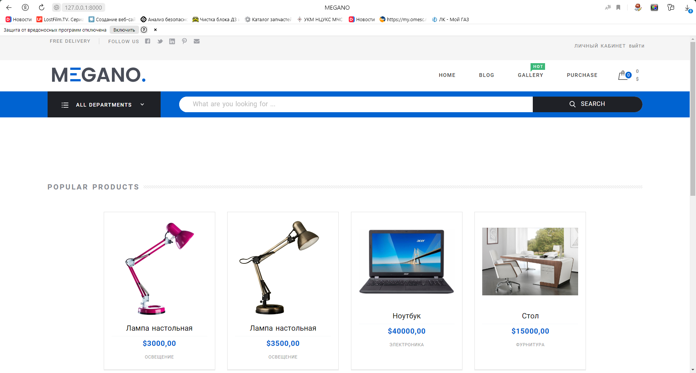

# Интернет-магазин MEGANO (дипломный проект)

Данный проект был написан в рамках учебного курса Программа профессиональной переподготовки «Python-разработчик». 
Верстка сайта была предоставлена платформой SkillBox, работа велась с backend-составляющей, 
при необходимости корректируя и дополняя html-,js-,css-код.

## Структура проекта
### Проект состит из следующих частей
1. Приложения:
 - `app_shop` - приложение товаров магазина;
 - `app_order` - приложение заказов, а также содержит сервисы сравнения;
 - `app_history` - приложение для отображения просмотренных товаров, истории заказов;
 - `app_users` - приложение пользователей и личного кабинета;
 - `app_cart` - приложение корзины;
2. Директории шаблонов:
 - `templates`;
3. Документация:
 - `README` - файл документации;
 - `requirements` - файл зависимостей;
4. Служебные директории:
 - `fixtures` - фикстуры с тестовыми данными для заполнения сайта контентом;
 - `locale` - файлы интернационализации;
 - `static` - статичные файлы верстки сайта;
 - `media` - директория для загружаемых моделями файлов;
5. Системные и служебные файлы:
 - `MyShop` - директория настроек django-проекта;

Документация по каждому из приложений расположена в директории `Readme`.

## Установка проекта
Для установки исходника интернет магазина необходимо ввести следующую команду:
```
git clone https://gitlab.skillbox.ru/aleksandr_peretiatko/Python_django_diploma_dpo
```
Чтобы проект работал корректно, необходимо установить зависимости командой:
```
git install -r requirements.txt
```
Следующим шагом будет создание суперпользователя для управления и доступа в админ-панель. Сделать это можно командой:
```
python manage.py createsuperuser
```
Также предусмотрена возможность заполнения проекта тестовыми данными с использованием скрипта `loadscript`:
